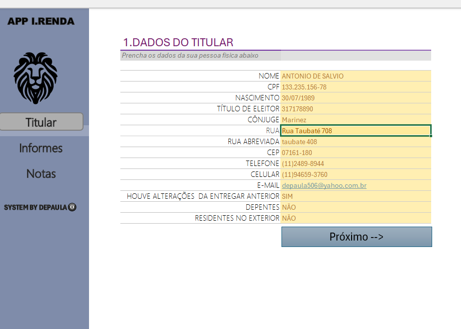
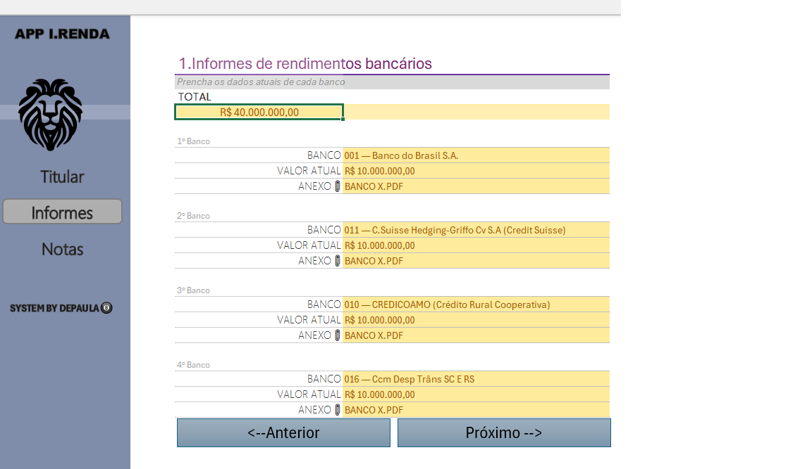
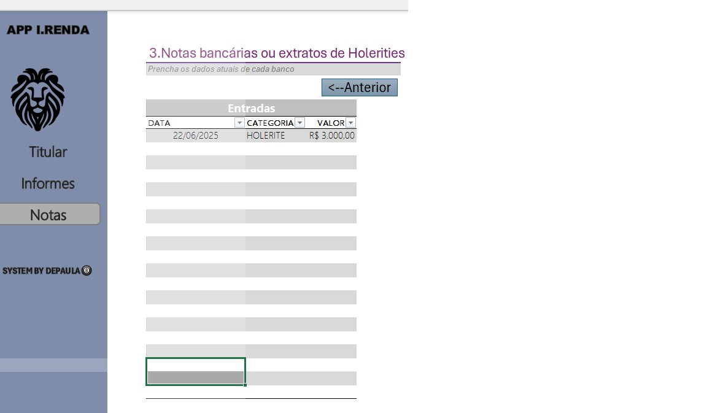

## Introdução
Aplicativo criado para dedução de imposto de renda com código de todos bancos vigentes.
Um agregador de informações para você ou a pessoa que esta usando para saber quais informações se deve reunir para declaração do imposto de renda 
num lugar só.
###  Primera tela

tela ande o titular pode  cadastrar seus dados pessoais e endereço.

### Segunda tela

Tela para cadastrar seus bancos onde provem os seus rendimentos.

### Terceira tela

Onde o titular podera cadastrar as suas entradas de rendimentos.
tudo feito com o microsoft excel com aparencia de sistema. 